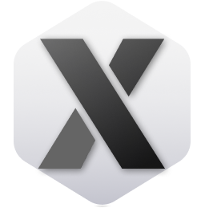

# X Minecraft Launcher Website (Unofficial)



[](https://vitejs.dev/) [](https://reactjs.org/) [](https://www.typescriptlang.org/) [](https://tailwindcss.com/) []()

This is an unofficial modern, animated, and accessible React + TypeScript frontend for the X Minecraft Launcher website. It provides information, downloads, changelogs, guides, and blog content for the launcher.

## Features

- **Modern UI**: Built with React and Tailwind CSS for a responsive and beautiful interface.
- **Animations**: Using Framer Motion and GSAP for smooth transitions.
- **Internationalization**: Supports multiple languages with react-i18next.
- **Downloads**: Interactive download section with OS detection and package information.
- **Blog and Changelogs**: Dynamic content rendering with Markdown support.
- **Accessibility**: Components built with Radix UI primitives.

## Supported Platforms

The launcher supports various operating systems, including:

- **Windows x64**: Download options for EXE installer.
- **macOS**: DMG and Homebrew support.
- **Linux**: Debian, RPM, AppImage, AUR, Flathub.

For each package, click the info icon to see system compatibility and features.

## Screenshots

  


*(Note: Replace with actual screenshot paths if available.)*

## Tech Stack

- **Frontend**: React v18.3.1, TypeScript v5.5.3
- **Build Tool**: Vite v5.4.1
- **Styling**: Tailwind CSS v3.4.13, tailwindcss-animate
- **Animations**: Framer Motion v11.5.4, GSAP v3.12.5
- **State Management**: TanStack React Query v5.59.0
- **Icons**: Lucide React v0.441.0
- **Routing**: React Router DOM v6.26.2
- **i18n**: react-i18next v15.0.2
- **Other**: Radix UI components, React Markdown, Syntax Highlighter

## Project Structure

- `src/pages/` - Page components and routes
- `src/components/` - Reusable UI and feature components
- `src/data/` - Static data like blog posts
- `src/translations/` - i18n files
- `src/utils/` - Helpers and utilities
- `src/types/` - Type definitions

## Getting Started

### Prerequisites

- Node.js v18+ 
- Bun (for running scripts)

### Installation

1. Clone the repository:
   ```
   git clone https://github.com/BANSAFAn/xmcl-website-NOT-OFFICIAL-.git
   ```

2. Install dependencies:
   ```
   bun install
   ```

3. Run development server:
   ```
   bun run dev
   ```

4. Build for production:
   ```
   bun run build
   ```

## Contributing

Contributions are welcome! Please open an issue or pull request.

## License

This project is licensed under the MIT License - see the [LICENSE](LICENSE) file for details.

---

For i18n guide, see [i18n.md](i18n.md)
