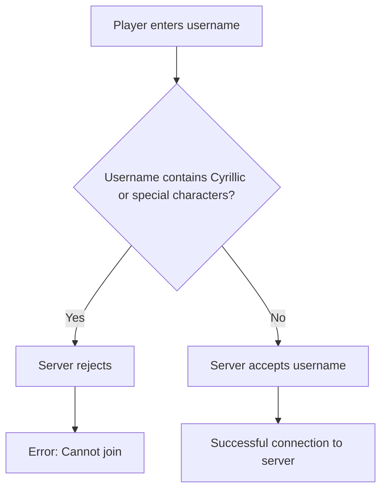

## ❗ Problem #1: Username

Have you ever wondered why your nickname on your favorite server might be unavailable or just not display correctly? The reason is likely the **characters** you are using.

### ❌ What CANNOT be used:

- **Cyrillic**: `ЯДолбаёбРусский`, `МойНик`, `Снегирь`
- **Special characters**: `@xewq!4c1`, `NIR&#$`, `My#Name`, `Player[1]`

> **Why?**  
> Most Minecraft servers **only support** Latin letters (`A-Z`, `a-z`), numbers (`0-9`), and the underscore (`_`).  
> This is done to ensure compatibility and security.

### ✅ What CAN be used:

- `Notch`, `Dream`, `Technoblade`
- `Player_1`, `Cool_Gamer`, `Mr_X`
- `KING_Player`, `DOMINATE_2025`

---

## 📸 Real-life Example

If you see a picture like this on a server:

**Think twice:**  
> Did you *really* want to use this username?  
> Or is it time to choose something that *works*?

---

## 🧠 Visualization: How the Name System Works

---

## 🎯 Recommendations

1. **Create a unique but simple username.**
2. **Use `_` instead of spaces or other characters.**
3. **Check the availability of your username on the server before connecting.**
