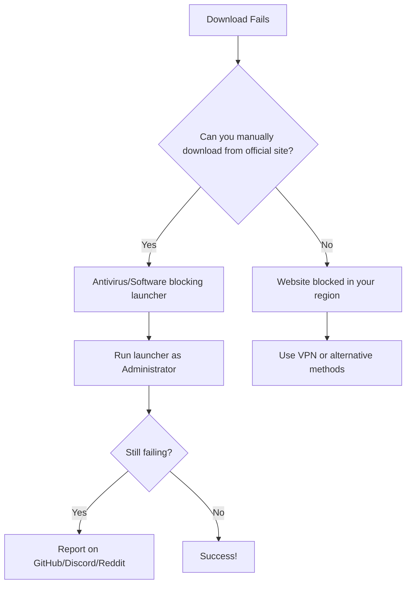

# Minecraft Download Troubleshooting Guide

Encountering errors while downloading Minecraft, mods, shaders, modpacks, or other resources? This guide will help you identify and resolve common download issues.

## 📋 Important Notice

> **All resources are official and we don't provide mirrors for downloads; everything is official.**
>
> *Exception: China, where BMCL API is used*

---

## 🔍 Identifying Resource Issues

If you're experiencing download errors, the first step is to determine if you have a **resource connectivity issue**.

### How to Check Your Network Connections:

1. Open **Task Manager**
   
3. Go to the second tab
   
4. Now check and see which ones were transmitted and which ones connected (if your connection is stuck, it means you don't have access to this resource)

---

## 🧪 Diagnostic Flow

---

## 🔐 Antivirus Compatibility

If the website is accessible but the launcher fails to download, your antivirus software might be blocking the connection.

> **⚠️ Note:** We don't recommend disabling your antivirus. Instead, please share your antivirus information with us on Discord or Reddit for further assistance.

### ✅ Compatible Antivirus Programs (Don't Block Connections):
- Windows Defender
- Kaspersky
- Avast
- ClamAV
- 360 Total Security
- Dr.Web
- Webroot
- Avira
- AVG
- McAfee
- Malwarebytes
- F-Secure
- G DATA
- ESET
- Bitdefender

---

## 🛠️ Troubleshooting Steps

### Step 1: Verify Manual Download
Try downloading the component manually from:
- **[Modrinth](https://modrinth.com)** (Note: Currently blocked in Russia - Well, terrorists, they can be blocked, but more precisely, they MUST be!)
- **[CurseForge](https://www.curseforge.com/minecraft)**
- Developer's official page

### Step 2: Administrator Rights (Windows Users)
Run your Minecraft launcher as administrator:
1. Right-click on the launcher executable
2. Select **"Run as administrator"**
3. Attempt the download again

### Step 3: Report Issues
If problems persist after trying the above steps, please report on:
- **GitHub**
- **Discord**
- **Reddit** (r/XMCL)

---

## 🎮 Enjoy Your Game!

That's all for now—play and have fun!

---

*Found this guide helpful? Consider sharing it with fellow Minecraft enthusiasts to help them troubleshoot download issues quickly!*
