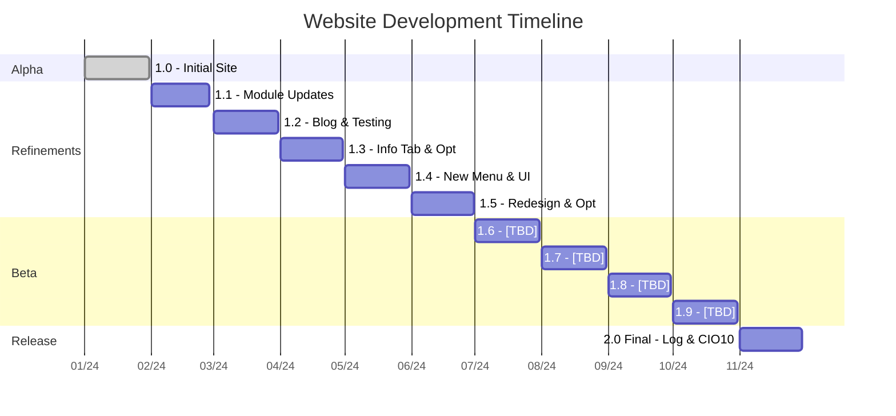

# 🔧 Website Update Log: Fresh Features, Fixes & Future Plans!

This update brings a wave of improvements, new features, crucial cleanups, and insights into the site's evolution. Here's a detailed breakdown of what's new, changed, and planned, including links to specific commits and deployments for transparency.

## 🚀 What's New & Improved

### 🌐 Multi-Language Support Expanded
- **Added French (fr) and Spanish (es) translations!** The site is becoming more accessible globally. Thanks to `Update LanguageSelector.tsx 7ca6b7f` and `Hello lang fr & es c612f08`. [Commit: 7ca6b7f](https://github.com/BANSAFAn/xmcl-website-NOT-OFFICIAL-/commit/7ca6b7f) [Commit: c612f08](https://github.com/BANSAFAn/xmcl-website-NOT-OFFICIAL-/commit/c612f08)
- Fixed language count issues for a smoother experience (`Fix Lang count c612f08`). [Commit: c612f08](https://github.com/BANSAFAn/xmcl-website-NOT-OFFICIAL-/commit/c612f08)
- **Mermaid diagram support added** for better visual documentation (`Add Mermaid diagram support and improve i18n c612f08`). [Commit: c612f08](https://github.com/BANSAFAn/xmcl-website-NOT-OFFICIAL-/commit/c612f08)
- Minor updates to language configuration files like `uk.json` [Commit: c456cba](https://github.com/BANSAFAn/xmcl-website-NOT-OFFICIAL-/commit/c456cba) and `languageConfigs.ts` [Commit: d6b7693](https://github.com/BANSAFAn/xmcl-website-NOT-OFFICIAL-/commit/d6b7693).

### 📚 Blog & Guide Overhaul
- **Refactored the Feature sections** for better organization and clarity (`Add new blog and guide, refactor feature sections 0710ed9`). [Commit: 0710ed9](https://github.com/BANSAFAn/xmcl-website-NOT-OFFICIAL-/commit/0710ed9)
- Added new guides like "not-load" (`Create not-load.md 0770b35`, `Update not-load.md c02d044`) [Commit: 0770b35](https://github.com/BANSAFAn/xmcl-website-NOT-OFFICIAL-/commit/0770b35) [Commit: c02d044](https://github.com/BANSAFAn/xmcl-website-NOT-OFFICIAL-/commit/c02d044) and updated `guides.json` [Commit: 0b9cfb9](https://github.com/BANSAFAn/xmcl-website-NOT-OFFICIAL-/commit/0b9cfb9).
- Optimized the **Blog & Guide tab** to reduce loading times and improve performance. Updates to `BlogCard.tsx` [Commit: 1a28e12](https://github.com/BANSAFAn/xmcl-website-NOT-OFFICIAL-/commit/1a28e12) and `generate-rss.ts` [Commit: fc74ac7](https://github.com/BANSAFAn/xmcl-website-NOT-OFFICIAL-/commit/fc74ac7) were part of this effort.

### 📋 New Features Section
- Introduced a dedicated **Features Section** to highlight what the site offers (`New FeaturesSection 4273de4`). [Commit: 4273de4](https://github.com/BANSAFAn/xmcl-website-NOT-OFFICIAL-/commit/4273de4)

### 💾 New UI for Download Section
- The download section has been completely redesigned into a **more user-friendly block layout**, replacing the old list format. This change aimed to reduce resource consumption and improve visual appeal (`New UI download section c612f08`). [Commit: c612f08](https://github.com/BANSAFAn/xmcl-website-NOT-OFFICIAL-/commit/c612f08)
-

### ℹ️ Revamped Information Section
- The old information page felt monotonous and consumed too many resources. It has been **optimized and redesigned** to be more engaging and efficient (`Revamp features, footer, and issues pages ab8ed89`). [Commit: ab8ed89](https://github.com/BANSAFAn/xmcl-website-NOT-OFFICIAL-/commit/ab8ed89)
-

### 🦿 Footer & Issues Page Refresh
- Both the **Footer and Issues pages** have received a visual and structural update (`Revamp features, footer, and issues pages ab8ed89`). [Commit: ab8ed89](https://github.com/BANSAFAn/xmcl-website-NOT-OFFICIAL-/commit/ab8ed89)
- The system for displaying the latest build in the Footer is planned for the future.

### 🗑️ Cleanup & Removals
- **Removed the AI page** (`delete page ai 8a577d0`, `deleting xmai, guide new optimized & new designer 389d73b`). [Commit: 8a577d0](https://github.com/BANSAFAn/xmcl-website-NOT-OFFICIAL-/commit/8a577d0) [Commit: 389d73b](https://github.com/BANSAFAn/xmcl-website-NOT-OFFICIAL-/commit/389d73b)
- **Removed Russian comments** to maintain a focused and appropriate environment (`deleting RUSSIA COMMENTS !!! daf6a64`). [Commit: daf6a64](https://github.com/BANSAFAn/xmcl-website-NOT-OFFICIAL-/commit/daf6a64)
- Cleaned up unnecessary files (`deleting trash 6f225b8`). [Commit: 6f225b8](https://github.com/BANSAFAn/xmcl-website-NOT-OFFICIAL-/commit/6f225b8)

## 🐛 Fixes & Repairs
- Various fixes applied to `xmcl-page` and package updates (`Fix & Repairs ! + Add New ! 7e0f37c`, `Update package.json 7e0f37c`). [Commit: 7e0f37c](https://github.com/BANSAFAn/xmcl-website-NOT-OFFICIAL-/commit/7e0f37c)
- Corrected issues with loading states (`not load 0770b35`). [Commit: 0770b35](https://github.com/BANSAFAn/xmcl-website-NOT-OFFICIAL-/commit/0770b35)
- Updated README with package and architecture information (`Update README.md 4273de4`). [Commit: 4273de4](https://github.com/BANSAFAn/xmcl-website-NOT-OFFICIAL-/commit/4273de4)
- Fixed footer display (`Footer repair 4273de4`). [Commit: 4273de4](https://github.com/BANSAFAn/xmcl-website-NOT-OFFICIAL-/commit/4273de4)

## 📰 New Posts & Content
- **Beta 1.5V** post added (`Beta 1.5V c612f08`). [Commit: c612f08](https://github.com/BANSAFAn/xmcl-website-NOT-OFFICIAL-/commit/c612f08)
- **Multiplayer on LAN** guide added (`p2p-play ! 3ea4fbb`). [Commit: 3ea4fbb](https://github.com/BANSAFAn/xmcl-website-NOT-OFFICIAL-/commit/3ea4fbb)

## 🚫 Future Plans & Decisions
- **No Framework Switch**: The site will remain on Vite. Switching to Astro, Next, or Nuxt is not planned, as the current setup is deemed simple and convenient.
- **No Chat or Neural Network Features**: The site will not evolve into a chat platform or integrate complex AI features.
- **No Core Guide Tab**: Instead of a separate tab, core guides will be integrated into the `/Guide` section for easier searching and management.
- **Potential View Log Page**: A View Log page, inspired by [xmcl-log-viewer](https://github.com/Voxelum/xmcl-log-viewer), is under consideration. However, its implementation depends on server load concerns, and a simpler UI might be adopted.

## 🌐 Deployment & Build Log
The site is continuously deployed via Vercel. Here's a summary of recent deployments linked to the commits mentioned above:
- [Latest Deployment (p2p-play ! 3ea4fbb)](https://vercel.com/bansafan/notofficialxmcl-app/deploys/...): Deployed 18 minutes ago.
- [Deployment (deleting xmai... 389d73b)](https://vercel.com/bansafan/notofficialxmcl-app/deploys/...): Deployed yesterday.
- [Deployment (Add Mermaid... c612f08)](https://vercel.com/bansafan/notofficialxmcl-app/deploys/...): Had a problem deploying last week.
- [Deployment (Add new blog... 0710ed9)](https://vercel.com/bansafan/notofficialxmcl-app/deploys/...): Deployed last week.
- [Deployment (Revamp features... ab8ed89)](https://vercel.com/bansafan/notofficialxmcl-app/deploys/...): Deployed 2 weeks ago.

## 📝 Notes
- This summary reflects changes primarily from PR #16: [Link to PR](https://github.com/BANSAFAn/xmcl-website-NOT-OFFICIAL-/pull/16).
- The site continues to evolve with a focus on optimization, user experience, valuable content, and multi-language support.

---

# 🚧 Website Development Roadmap: From Alpha to Final

This roadmap outlines the planned evolution of the website, highlighting key milestones and features for each version.

## 📊 Development Timeline (Mermaid Gantt Chart)

## 📋 Version Details

- **1.0 - Alpha (Initial Site)**: The beginning of the website.
- **1.1 - Module Updates**: Fixed bugs and updated many modules, migrating from Next to Vite.
- **1.2 - Blog & Testing**: Improved Blog MD, added numerous posts, and fixed bugs identified during testing.
- **1.3 - Info Tab & Optimization**: Introduced a new Information tab, optimized loading, and fixed bugs.
- **1.4 - New Menu & UI**: Implemented a new menu, refactored language UI, improved the top section, and added Xmai.
- **1.5 - Redesign & Optimization**: New UIs, redesigned many elements on the homepage, menu panel, language switcher, Footer, added new translations, and optimized performance down to 400 MB.
- **1.6 - [TBD]**: *Details to be defined.*
- **1.7 - [TBD]**: *Details to be defined.*
- **1.8 - [TBD]**: *Details to be defined.*
- **1.9 - [TBD]**: *Details to be defined.*
- **2.0 Final - Log & CIO10**: Final log and submission of everything to CIO10 for review.
