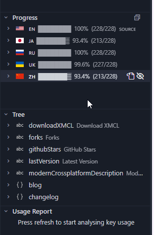

# Beta 1.4 — Now Live! 🚀

We're excited to announce the release of **Beta 1.4** of our site! A lot has changed under the hood and in the interface, and we can't wait for you to explore it. Here's what’s new:

---

## ✨ What’s New in Beta 1.4

### 🌐 Enhanced i18n Support
**Translations** are now seamlessly integrated into **VS Code, Zed, Vim, and Neovim**!  
This means you can now contribute translations and add new languages with ease — everything is pre-configured for you. Start localizing content faster than ever before!

### 🧭 Improved Navigation
We’ve redesigned the **navigation experience** to be more intuitive and visually appealing. It's sleeker, smoother, and better organized to help you find what you need in no time.

### 📥 Optimized Download & Info Section
The **download section** has been optimized for speed and clarity. Information is now presented more concisely, making it easier to find the resources you need.

### ⚙️ Ditched Astro.js
We’ve fully **migrated away from Astro.js**. The previous setup required complex and time-consuming migration steps, so we decided to switch to a more maintainable solution to ensure faster development cycles going forward.

### 📡 RSS Feeds Added
We’ve added **RSS feeds** for both the **Guide** and **Blog** sections. Now you can stay up-to-date with the latest articles and updates directly in your favorite RSS reader.

---

## 🚧 What’s Coming Next?

### 📝 More Content on the Way
We’re planning to **expand the Guide and Blog** with more insightful posts, tutorials, and updates.

### 🤖 Discord Integration for Devlogs
Soon, you’ll be able to **sync your development logs with Discord** — all through the blog system. Stay tuned for this exciting feature!

### 🔧 GitHub API & Issues Fixes
We’re working on **resolving GitHub API and Issues integration** problems to provide a better feedback loop and contribution experience.

### 📋 Enhanced Changelog View
The **changelog section** will receive a redesign — expect a cleaner, more visual way to browse updates and changes.

### 🧪 Improved Testing Tab
We’re upgrading the **Testing tab** to offer a better overview of packages and the latest updates. You’ll be able to track testing progress with more clarity and detail.

### 🧠 AI Integration
We’re exploring **AI-powered features** to enhance user experience on the site. From smarter content suggestions to automated workflows — stay tuned for more details!

---

## 🙌 Thank You!

Thanks for being part of our journey. Your feedback and support drive every update and improvement. Keep exploring, and don’t hesitate to share your thoughts!

👉 [Explore the new Beta 1.4 now!](#)