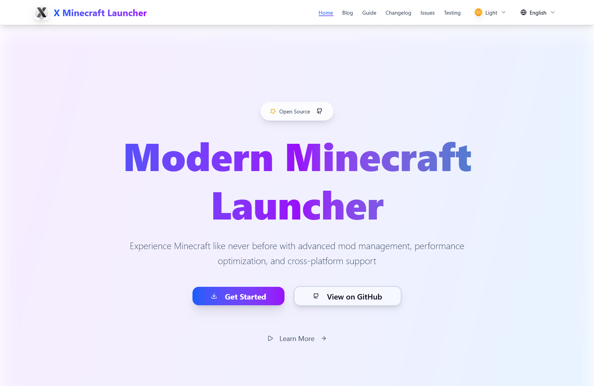
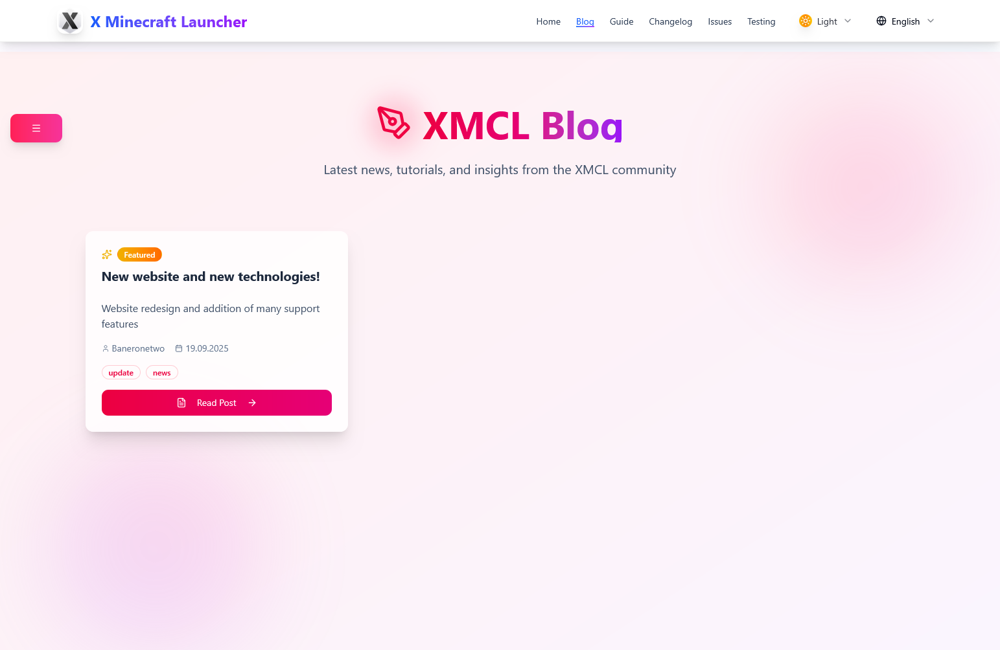
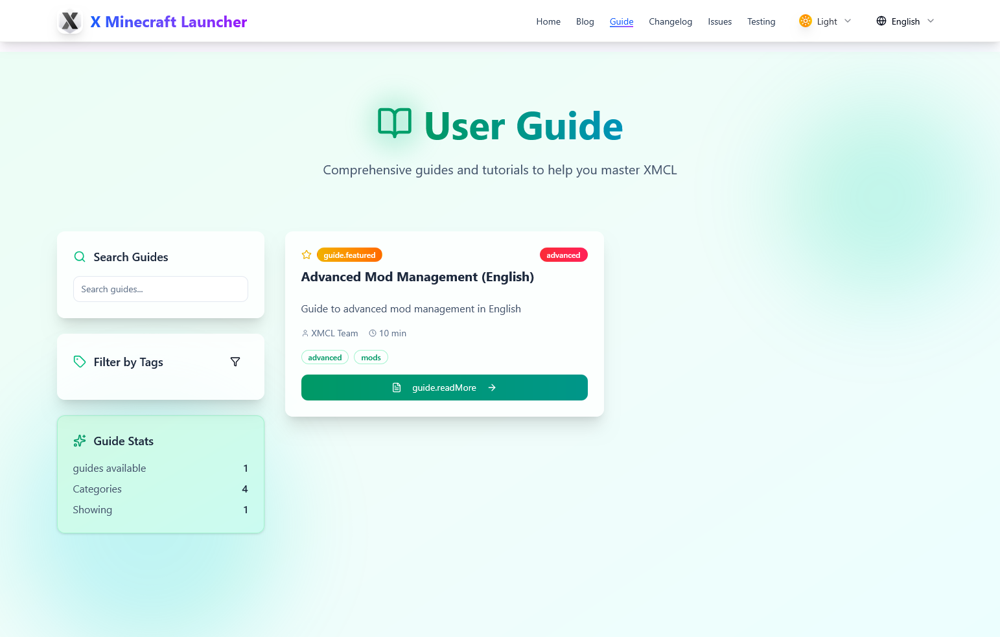
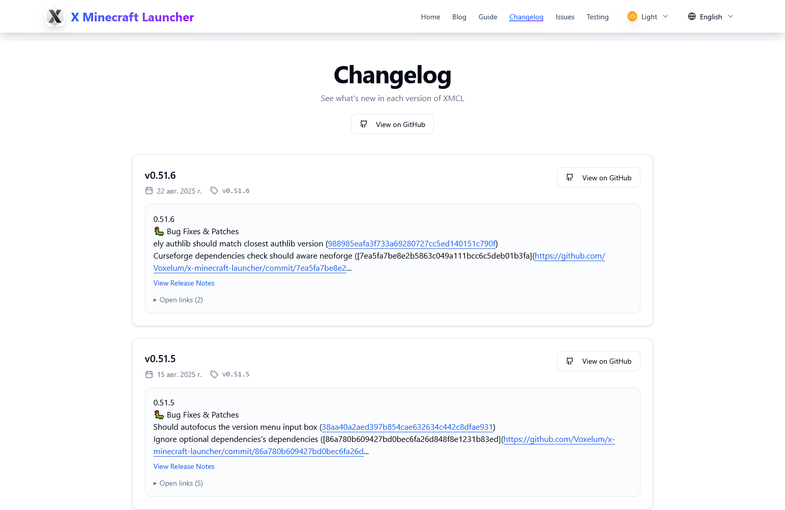
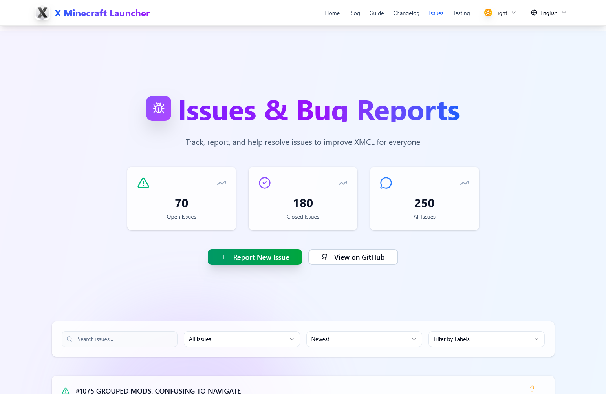
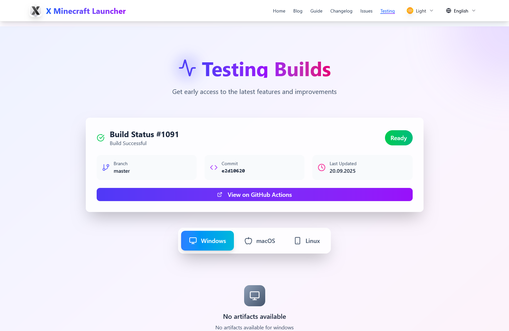

# 🎉 Website Overhaul & New Features Released!

  
*Redesigned homepage with improved UX and download section.*

We’re thrilled to announce a major update to our website! The layout has been completely reworked, performance enhanced, and several brand-new sections have been added to make your experience smoother, clearer, and more enjoyable.

---

## 🏠 Homepage — Fresh Look, Smarter Info

The homepage has received a visual refresh and a complete overhaul of its information architecture. We’ve also redesigned the **Download Section** to be more intuitive and functional.

✅ New lightweight filters to help you find what you need faster  
✅ Added new package bundles not available in the previous version  
✅ Footer redesigned for easier navigation and quick-access info

---

## 📝 Blog Tab — Now with Tags & Filters!

The blog section is now more powerful and visually appealing. You can now:

- Filter posts by **tags**  
- Sort and browse with ease  
- Enjoy a cleaner, modern layout that helps you truly understand every update, tip, or announcement

Whether you’re here for news, tips, or deep dives — it’s all organized and beautiful.

---

## 🧭 Guides Tab — Learn How to Use the Launcher

Similar in structure to the blog, but styled with a slightly different color palette for easy distinction. Don’t worry — it won’t confuse you! It’s designed for clarity and ease of learning.

📌 *Coming soon: A full library of guides on how to use every feature of the launcher!*

---

## 📋 Changelogs Tab — **NEW!**

This tab didn’t exist in the previous version — and now it’s here to keep you fully informed!

- View the latest **release notes**  
- See detailed breakdowns of every update  
- Understand what changed, what was fixed, and what’s coming next

Stay in the loop — no more guessing what’s new!

---

## ❓ Issues Tab — **NEW!**

Many of you asked: *“Where do I report bugs or ask questions?”*  
Now you have a dedicated space — and we’re using it to show you that we’re actively listening and working on your feedback.

✅ Browse open and resolved issues  
✅ See how we’re addressing problems  
✅ Maybe even find the answer to *your* question already solved!

Transparency is key — and this tab proves we’re working hard behind the scenes.

---

## 🧪 Testing Tab — Not New, But Now Visible!

Previously hidden, this tab is now front and center for all our adventurous testers!

Love trying out the latest builds? Here’s where you’ll find:

- Early access to bleeding-edge versions (when available)  
- Details on experimental changes  
- Direct links to test builds

Perfect for those who like to live on the edge — and help us make the launcher better.

---

## 🚀 The Site Is Just Getting Started…

This is only the beginning! The website will continue to evolve based on your feedback and our roadmap.

🌍 **Want to help translate the site?**  
Check out our **i18n guide** — it explains step-by-step how to contribute your language or improve existing translations.

👉 [Link to i18n Guide] *(insert link here)*

---

Thank you for being part of this journey.  
Let us know what you think — and happy exploring!

