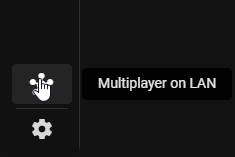
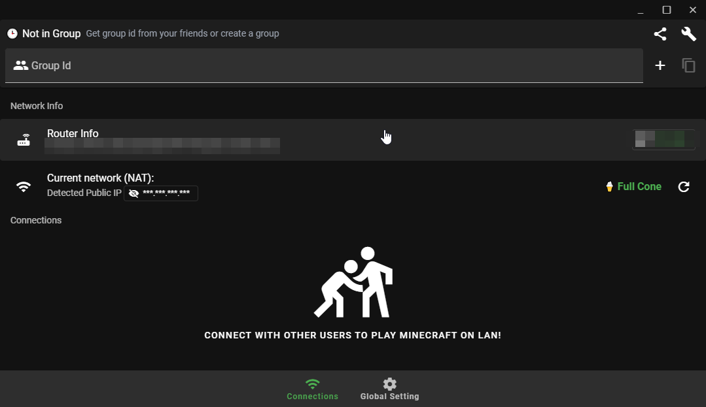
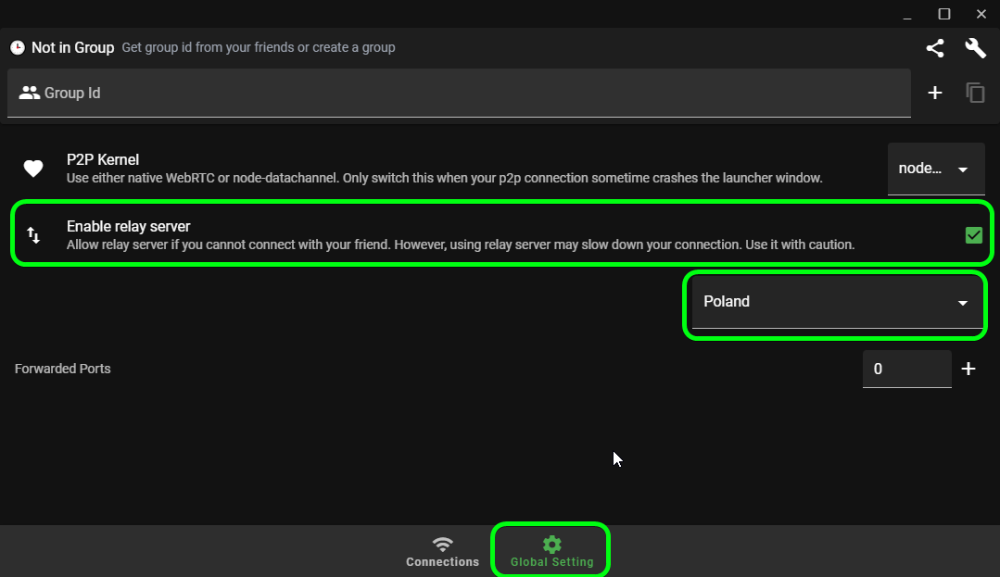
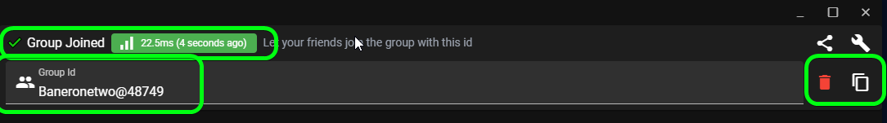
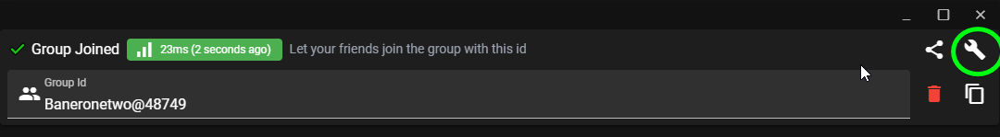
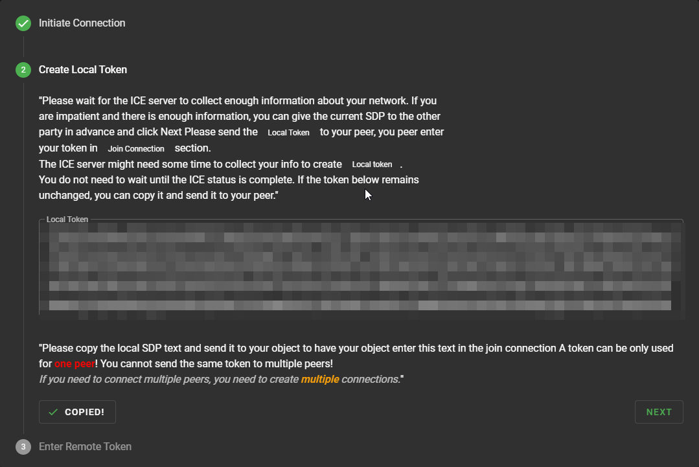
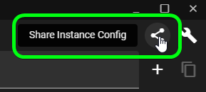
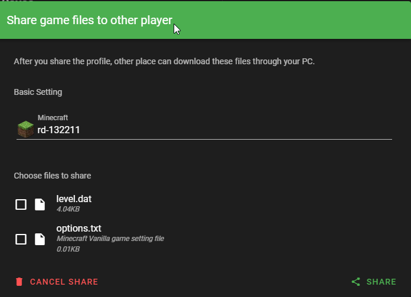

# Minecraft LAN Multiplayer Guide

This guide will help you set up and play Minecraft with your friends over a local network or even the internet using the launcher's built-in features.

## What is P2P (Peer-to-Peer)? A Simple Explanation

P2P stands for "Peer-to-Peer". Think of it like this: instead of everyone connecting to one big central server (like a main computer in the sky), players connect *directly* to each other's computers. It's like having a direct phone line between friends instead of everyone calling through one operator.

- **Direct Connection:** Your computer talks *directly* to your friend's computer.
- **No Central Server:** Unlike online servers, you don't need a dedicated machine running 24/7.
- **LAN:** Works best on the same local network (e.g., same WiFi at home).
- **Internet Play:** Can work over the internet, but requires specific network configurations (like the launcher's relay system described below).

This is what allows players to join a game hosted on one person's computer without needing a complex server setup.

## Getting Started: Opening the Multiplayer Window

First, open the "Multiplayer on LAN" window in the launcher:

## Understanding Your Connection Status

Once opened, you'll see your status, IP address, and router information. The most important part is your **status**:

- **Status 1 or 2:** You're good to go! You can play with friends without issues.
- **Other Statuses:** If you see a different status number, it means your connection type might not be ideal for direct play. You'll need to look up solutions specific to your internet setup or firewall. (Try refreshing the status in the launcher first - sometimes it helps!)

## How to Play: With or Without a License

### Option 1: Licensed Players
If everyone has a Minecraft license, you can use the standard LAN multiplayer:
1. One person starts a world in Minecraft and opens it to LAN.
2. The other players look for the game in their Minecraft multiplayer list.

### Option 2: Using the Relay Server (For Unlicensed Players or Difficult Connections)
If you don't have a license or have connection issues, the launcher provides a relay server feature:
1. Go to **Global Settings**.
2. Enable the **Relay Server** function.
   - *Note:* If this option isn't available, your internet provider might be blocking access to it.

## Setting Up the Connection

### Method 1: Using Connection IDs (Easier)
1. **Create an ID:** Click the `+` button in the multiplayer window.
2. **Share the ID:** Send your generated ID to your friend.

3. **Friend joins:** Your friend clicks `+` and enters your ID in the appropriate field.
4. **Connected:** Your friend should now be connected to you!

### Method 2: Manual Connection (If Method 1 Fails)
If the ID method doesn't work, use the manual connection settings:

1. Click on the **settings** icon.

2. One person uses **"Initiale-Connection"** (creates the connection).

3. The other uses **"Join"** (connects to the host).
4. The host needs to send their connection key, and the friend needs to accept it.

## Sharing Worlds

Once connected, you can share world instances with your friends using the dedicated button in the interface.

## Starting the Game

1. **Host:** Open Minecraft, start a world, and open it to LAN.
2. **Players:** Go to Multiplayer in Minecraft, and the hosted game should appear at the bottom of your server list!

## Network Optimization
### For the best experience, consider these network settings:

* Use a stable internet connection with at least 5 Mbps upload speed
* Prefer wired connections over WiFi when possible
* **Close bandwidth-intensive applications during gameplay**
* **Disable unnecessary background services**

## Need Help?

If you encounter problems, feel free to ask for help on Discord, Reddit, or other Minecraft communities.
